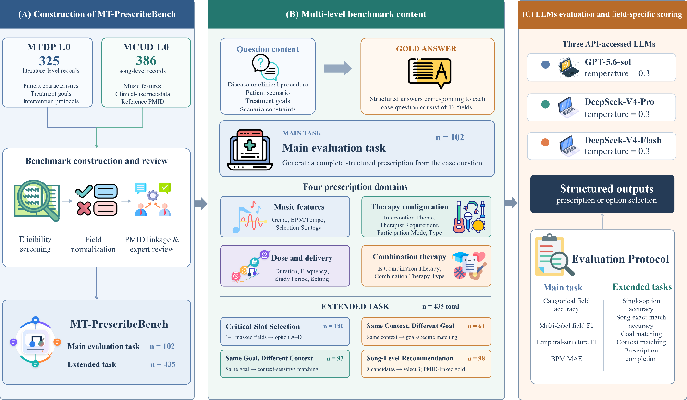

<h1 align="center">MT-PrescribeBench</h1>

<p align="center">A Benchmark for Evaluating Large Language Models in Personalized Music-Based Intervention Planning and Song-Level Recommendation.</p>

<p align="center">
  <a href="./LICENSE"></a>
  
  
  
</p>

- <div align="center">
  
</div>

---

##  Overview

This is the official data and code repository for the paper:

**MT-PrescribeBench: A Benchmark for Evaluating Large Language Models in Personalized Music-Based Intervention Planning and Song-Level Recommendation
Zhichuan Xu, Jie Song, Cheng Bi, Yuxin Zhang, Xin Zheng, Meng Xiao, Xiaoran Li, Qiongfang Cao, Ziyu Lu, Hao Yang, Xiaoying Mao, Bairong Shen**

**Abstract**
Cognitive impairment, mental disorders, and pain impose substantial disease and caregiving burdens, creating a need for personalized and evidence-informed music-based interventions. However, designing such interventions requires the coordinated interpretation of patient or clinical context, therapeutic goals, intervention procedures, musical parameters, and treatment schedules. Although large language models have shown promise in general medical information processing, their ability to generate structured music-based intervention prescriptions and select clinically appropriate songs remains unclear. We developed MT-PrescribeBench, an evidence-linked benchmark designed to evaluate these capabilities across multiple levels of intervention planning. The benchmark included 102 case-based questions for structured prescription generation and 435 targeted questions assessing prescription completion, treatment-goal matching, clinical-context matching, and Song-Level Recommendation. GPT-5.6-sol, DeepSeek-V4-Pro, and DeepSeek-V4-Flash were evaluated against literature-derived reference answers using field-specific metrics and task-level accuracy. In structured prescription generation, categorical accuracy ranged from 64.71% to 68.63%, multi-label F1 scores from 61.36% to 64.89%, and temporal-structure F1 scores from 39.10% to 46.35%. Performance was relatively strong for implementation setting but weaker for genre, music selection strategy, intervention duration, study period, and tempo prediction. Among the targeted tasks, prescription completion, treatment-goal matching, and clinical-context matching achieved accuracies of 64.06%–77.22%, whereas exact-match accuracy for Song-Level Recommendation reached 86.73%–89.80% when reference prescriptions were provided. No model showed a consistent overall advantage. These findings indicate that current large language models can assist with selected structured subtasks, particularly initial prescription drafting and evidence-linked song screening, but remain unreliable in determining core musical parameters and treatment schedules. MT-PrescribeBench provides a reproducible framework for identifying these capability gaps and supporting future human–AI collaboration in personalized music-based intervention planning. 


##  Resources

- `Benchmarks/Main evaluation task/`: the 102 case questions and their structured gold cards.
- `Benchmarks/Targeted extended tasks/`: gold cards and question files for the four targeted tasks.
- `Data Source/MTDP1.0.xlsx`: literature-level music-based intervention records.
- `Data Source/MCUD1.0.xlsx`: song-level clinical-use records and musical metadata.
- `Code/score.py`: field-level scoring utilities.
- `Code/Benchmark_Prompts.py`: public prompt templates.
- `Outputs/`: released raw and evaluated example results with neutral model labels.

##  Reproducibility

The public package uses repository-relative paths. Provider-specific runtime adapters, credentials, endpoints, and private execution configuration are excluded from the release.

```powershell
python -m venv .venv
.venv\Scripts\Activate.ps1
python -m pip install pandas openpyxl jupyter
python -m py_compile Code\score.py Code\Benchmark_Prompts.py
```

The notebooks in `Code/` document the public execution and evaluation workflow. To run a model locally, supply a compatible provider adapter through your own environment and keep all credentials outside the repository.

##  Evaluation Tasks

### Main evaluation task

Each case presents a patient or clinical context, therapeutic goals, and scenario constraints. The system produces a structured intervention prescription. The scorer evaluates fixed-value categorical fields, multi-label fields, duration/frequency/study-period components, and BPM/tempo using symmetric nearest-neighbor MAE.

### Targeted extended tasks

1. **Prescription completion:** select missing fields from controlled options.
2. **Treatment-goal matching:** distinguish prescriptions associated with different goals in a shared context.
3. **Clinical-context matching:** distinguish prescriptions associated with different clinical contexts under a shared goal.
4. **Song-Level Recommendation:** select three evidence-linked songs from eight visible candidates.

##  How to Use

1. Open the relevant workbook in `Benchmarks/`.
2. Use the question columns as model inputs.
3. Save model responses in the corresponding output schema.
4. Apply the functions in `Code/score.py` or use `evaluate_benchmarks.ipynb`.
5. Report field-level and task-level metrics together with the benchmark version.

The benchmark is designed for research evaluation. It does not provide clinical advice and should not be used to make unsupervised treatment decisions.

##  Citation

If you use MT-PrescribeBench, please cite the accompanying article and this repository. The final article citation will be added after publication.

```text
MT-PrescribeBench. Data and evaluation package.
https://github.com/AXTAdam/MT-PrescribeBench
```

##  Contact

For questions about the benchmark, please open a GitHub issue. Do not include API credentials, private patient information, or unpublished model outputs in an issue.

## License

The public code and release materials are distributed under the MIT License where applicable. Please check the original source-paper and dataset terms before redistributing source-derived data.
